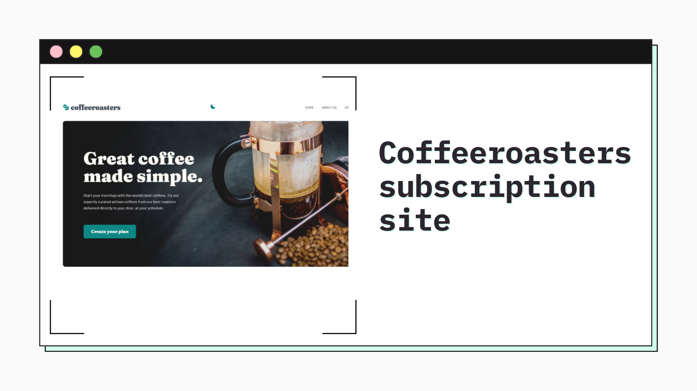

<h1 align="center">Coffeeroasters subscription site
</h1>

<div align="left">

</div>

&nbsp;



<h2 align="center"> 
	🚧 Coffeeroasters subscription site 🟢 Completed 🚀 🚧
  
</h2>

&nbsp;

<!--
## Table of contents

- [Project description](#description) - [What I learned](#What-I-learned) -->

<h2 id="#description">Project description 📚</h2>

This is a solution to the challenge
[Coffeeroasters subscription site](https://www.frontendmentor.io/challenges/coffeeroasters-subscription-site-5Fc26HVY6).

This challenge will have you building a 3-page subscription site. As part of the project, you'll create an interactive subscription page to test your JS and logic skills!

<a href="https://www.frontendmentor.io/challenges?difficulties=4"></a>

&nbsp;

## Functionalities

The interactive subscription page has a number of specific behaviours, which are listed below:

- If "Capsule" is selected for the first option

  - The "Want us to grind them?" section should be disabled and not able to be opened

- Order summary texts updates

  - If "Capsule" is selected, update the order summary text to:
    - "I drink my coffee **using** Capsules"
    - Remove the grind selection text
  - If "Filter" or "Espresso" are selected, update the order summary text to:
    - "I drink my coffee **as** Filter||Espresso"
    - Keep/Add the grind selection text
  - For all other selections, add the selection title in the blank space where appropriate

- Updating per shipment price (shown in "How often should we deliver?" section at the bottom) based on weight selected
  - If 250g weight is selected
    - Every Week price per shipment is $7.20
    - Every 2 Weeks price per shipment is $9.60
    - Every Month price per shipment is $12.00
  - If 500g weight is selected
    - Every Week price per shipment is $13.00
    - Every 2 Weeks price per shipment is $17.50
    - Every Month price per shipment is $22.00
  - If 1000g weight is selected
    - Every Week price per shipment is $22.00
    - Every 2 Weeks price per shipment is $32.00
    - Every Month price per shipment is $42.00
- Calculating per month cost for the Order Summary modal
  - If Every Week is selected, the Order Summary modal should show the per shipment price multiplied by 4. For example, if 250g weight is selected, the price would be $28.80/month
  - If Every 2 Weeks is selected, the Order Summary modal should show the per shipment price multiplied by 2. For example, if 250g weight is selected, the price would be $19.20/month
  - If Every Month is selected, the Order Summary modal should show the per shipment price multiplied by 1. For example, if 250g weight is selected, the price would be $12.00/month

## Small demo of the interactive page

<a href="./readme/demo.mp4" download>DEMO</a>

## Starting the project:

```js
npm init
```

### I used parcel to package the modules.

instando Parcel com npm:

```js
npm i parcel -D
```

I also used SASS, which is a CSS preprocessor. I used this 7-1 Sass Architecture, to organize my files:

```js
sass/
|
|– abstracts/
|   |– _variables.scss    # Sass Variables
|   |– _mixins.scss       # Sass Mixins
|
|– vendors/
|   |– _bootstrap.scss    # Bootstrap
|
|– base/
|   |– _reset.scss        # Reset/normalize
|   |– _typography.scss   # Typography rules
|
|– layout/
|   |– _navigation.scss   # Navigation
|   |– _grid.scss         # Grid system
|   |– _header.scss       # Header
|   |– _footer.scss       # Footer
|   |– _sidebar.scss      # Sidebar
|   |– _forms.scss        # Forms
|
|– components/
|   |– _buttons.scss      # Buttons
|   |– _carousel.scss     # Carousel
|   |– _cover.scss        # Cover
|   |– _dropdown.scss     # Dropdown
|
|– pages/
|   |– _home.scss         # Home specific styles
|   |– _contact.scss      # Contact specific styles
|
|– themes/
|   |– _theme.scss        # Default theme
|   |– _admin.scss        # Admin theme
|
 – main.scss              # Main Sass input file
```

Learn more about this architecture: <a href="https://www.learnhowtoprogram.com/user-interfaces/building-layouts-preprocessors/7-1-sass-architecture">7-1 Sass Architecture</a>

## What I learned

implement the interactive signature page with classes (OOP) where I could have a better organization, where I could also put into practice my skills with logic

```js
class App {
  // private properties
  /** leaving only an index of 1, which is "Do you want us to shred?" so you don't have to verify again */
  #arrCheckButton = [0, 0, 0, 1, 0];
  #checked = true;
  #valided = true;
  #checkedSelection = true;

  constructor() {
    this._eventClick();
  }

  _eventClick() {
    planSelectionContainer.addEventListener(
      "click",
      this._workingClick.bind(this)
    );
  }

  _workingClick(e) {
    this._accordion(e);

    this._activeAside(e);

    this._selectingOption(e);

    this._updateOrderSummaryTitleOption(e);
  }

  _accordion(e) {
    e.preventDefault();
    let preferenceOpen;

    if (e.target.matches("[data-button]")) {
      preferenceOpen = e.target.closest("[data-open]");

      if (!preferenceOpen.hasAttribute("open"))
        preferenceOpen.setAttribute("open", "");
      else preferenceOpen.removeAttribute("open");
    }
  }

  _activeAside(e) {
    const listAside = document.querySelectorAll(`[data-list-aside]`);
    listAside.forEach((_, index) => {
      if (e.target.matches(`[data-button ='${index}']`)) {
        const element = document.querySelector(`[data-list-aside="${index}"]`);
        listAside.forEach((list) => list.classList.remove(activeClass));
        element.classList.add(activeClass);
      }
    });
  }

  _selectingOption(e) {
    const clickedOption = e.target.closest("[data-option]");
    const optionsAll = e.target.closest("[data-options]");
    if (!clickedOption) return;
    const optionsArr = optionsAll.querySelectorAll("[data-option]");
    optionsArr.forEach((opt) => opt.classList.remove(activeClass));
    clickedOption.classList.add(activeClass);
  }

  _updateOrderSummaryTitleOption(e) {
    let titleEl;
    const clickedPreferences = e.target.closest("[data-open]");

    const planReply = e.target.closest("[data-option]");

    if (!planReply) return;

    // adding selection title in white space where appropriate
    titleEl = planReply.querySelector(".plan__reply--title");
    const titleOrderEl = document.querySelectorAll(
      ".plan__order-summary--box [data-title]"
    );
    titleOrderEl.forEach((titleOrder) => {
      if (titleOrder.dataset.title === titleEl.dataset.title)
        titleOrder.textContent = titleEl.textContent;
    });

    const title = titleEl.textContent;

    this._workSectionHow(clickedPreferences, title);

    this._activation_button(clickedPreferences, planReply);

    // UPDATE PRICE for "How often should we deliver?"
    this._updatePriceSectionDeliver(title);

    // UPDATE PRICE Modal
    this._updatePriceModal(title);
  }

  _workSectionHow(clickedPreferences, title) {
    const updateTextOrderSummary = function (valueDisplay) {
      document.querySelector(
        ".plan__order-summary--box [data-title='3']"
      ).style.display = valueDisplay;
      document.getElementById("complet").style.display = valueDisplay;
    };

    if (clickedPreferences.matches(`[data-open="0"]`)) {
      if (title.includes("Capsule")) {
        // Order summary texts updates
        orderSummaryText.innerHTML = orderSummaryText.innerHTML.replace(
          "as",
          "using"
        );
        updateTextOrderSummary("none");

        this.blockGrind("add", "0.5");

        this.defaultGrind();
        this.#checkedSelection = true;
        this.#checked = true;
      } else if (title.includes("Filter") || title.includes("Espresso")) {
        orderSummaryText.innerHTML = orderSummaryText.innerHTML.replace(
          "using",
          "as"
        );
        updateTextOrderSummary("inline");
        this.blockGrind("remove", "1");

        if (this.#checkedSelection) {
          document
            .getElementById("btn-disabled")
            .classList.remove("activeButton");
          document
            .querySelector(".btn-box")
            .querySelector('[data-disabled="blockGrind"]')
            .classList.remove("block");
          this.#checked = false;
        }
      }
    }
  }

  defaultGrind() {
    document.querySelector('[data-open="3"]').removeAttribute("open");
    document
      .querySelector('[data-open="3"]')
      .querySelectorAll("[data-option]")
      .forEach((opt) => opt.classList.remove(activeClass));
  }

  // The "Want us to grind them?" section should be disabled and not able to be opened
  blockGrind(pro, opa) {
    blockGrind.classList[`${pro}`]("block");

    blockGrind
      .closest("[data-open]")
      .querySelector(".plan__title").style.opacity = opa;

    document
      .querySelector(".plan__item:nth-child(4)")
      .classList[`${pro}`]("block");
    document
      .querySelector('[data-disabled="blockGrind"]')
      .classList[`${pro}`]("block");
  }

  _activation_button(clickdPreferences) {
    this.#arrCheckButton.forEach((_, index) => {
      if (clickdPreferences.matches(`[data-open="${index}"]`)) {
        this.#arrCheckButton[index] = 1;
      }

      if (clickdPreferences.matches(`[data-open="${index === 3 && 3}"]`)) {
        this.#checked = true;
        this.#checkedSelection = false;
      }

      if (this.#checked) {
        this.#valided = this.#arrCheckButton.every((act) => act === 1);

        if (this.#valided) {
          document.getElementById("btn-disabled").classList.add("activeButton");
          document
            .querySelector(".btn-box")
            .querySelector('[data-disabled="blockGrind"]')
            .classList.add("block");
        }
      }
    });
  }

  _updatePriceSectionDeliver(title) {
    function updatePrice(price) {
      price.forEach((_, index) => {
        document.querySelector(`[data-price="${index}"]`).innerText =
          price[index];
      });
    }

    let updatePriceModal = this._updatePriceModal;

    // Updating the price in the modal when the user changes options in the "How much would you like?"
    function updatingModalPricePerUnit() {
      const sectionDeliver = document.querySelector('[data-open="4"]');
      const planReplyArr = sectionDeliver.querySelectorAll("[data-option]");
      planReplyArr.forEach((plan) => {
        if (plan.classList.contains(activeClass)) {
          const title = plan.querySelector(".plan__reply--title").textContent;
          updatePriceModal(title);
        }
      });
    }

    // Updating per shipment price (shown in "How often should we deliver?" section at the bottom) based on selected weight
    if (title === "250g") {
      updatePrice(["$7.20", "$9.60", "$12.00"]);
      updatingModalPricePerUnit();
    }

    if (title.includes("500g")) {
      updatePrice(["$13.00", "$17.50", "$22.00"]);
      updatingModalPricePerUnit();
    }

    if (title.includes("1000g")) {
      updatePrice(["$22.00", "$32.00", "$42.00"]);
      updatingModalPricePerUnit();
    }
  }

  // Calculating per month cost for the Order Summary modal
  _updatePriceModal(title) {
    if (!title) return;

    function updatePriceModal(value, index) {
      const price =
        +document
          .querySelector(`[data-price="${index}"]`)
          .textContent.slice(1, -1) * value;

      document.querySelector(".modal__price").textContent = `$${price.toFixed(
        2
      )}/mo`;
    }

    if (title.includes("Every week")) {
      updatePriceModal(4, "0");
    }
    if (title.includes("Every 2 weeks")) {
      updatePriceModal(2, "1");
    }
    if (title.includes("Every month")) {
      updatePriceModal(1, "2");
    }
  }
}
```

## Links

- [Preview Site](https://coffeeroasters-subscription-vinicius.netlify.app)

&nbsp;

## My process

### Built with

- [HTML](https://developer.mozilla.org/en-US/docs/Web/HTML)
- [CSS](https://developer.mozilla.org/en-US/docs/Web/CSS)
- [Flexbox](https://css-tricks.com/snippets/css/a-guide-to-flexbox/)
- [CSS Grid](https://css-tricks.com/snippets/css/complete-guide-grid/)
- [Vanilla Js](http://vanilla-js.com)
- [Parcel](https://parceljs.org)
- [SCSS](https://parceljs.org)

&nbsp;

## 👨‍💻 Author

- [Frontend Mentor](https://www.frontendmentor.io/profile/viniciusshenri96)
- [Linkedin](https://www.linkedin.com/in/vinícius-henrique-7a2533229/)
